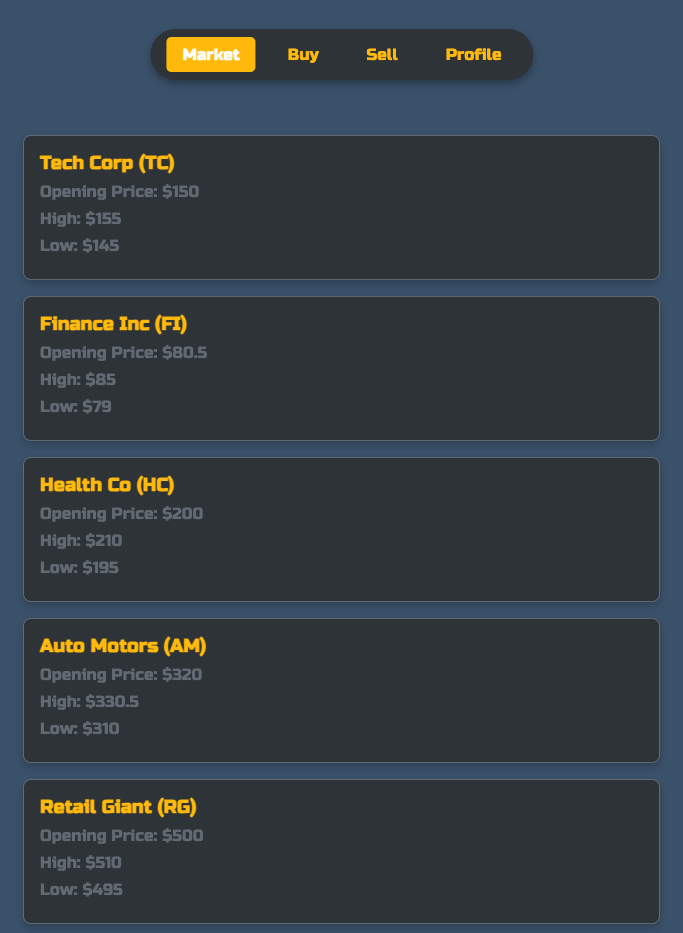
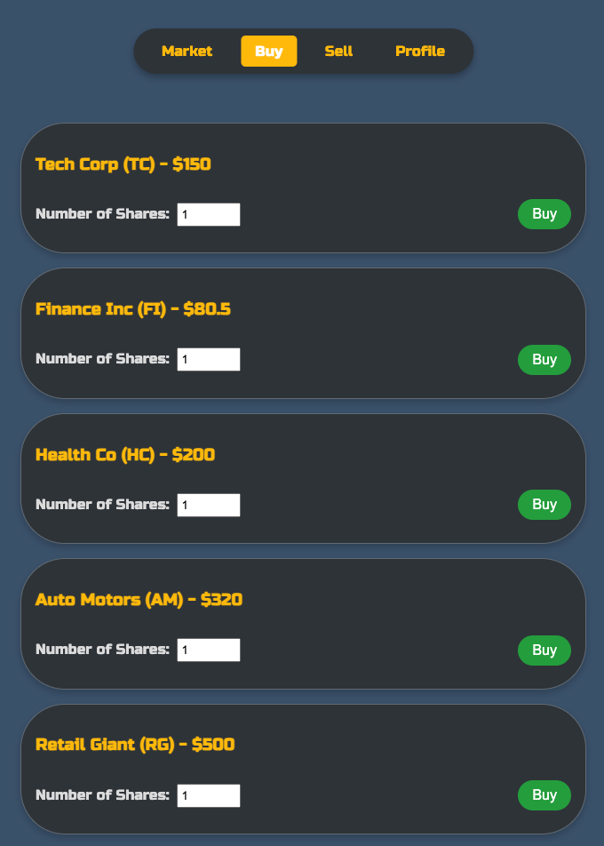
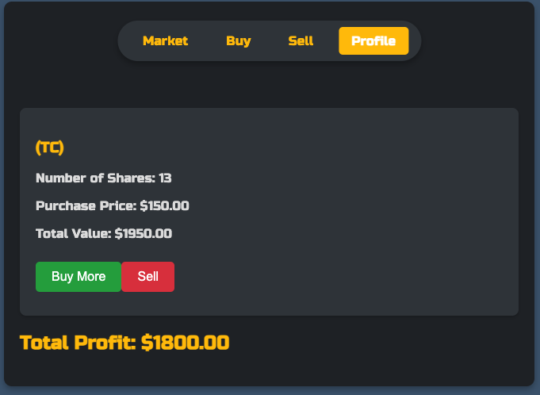

# Trade-King

**Trade-King** is a frontend-only stock trading application designed for educational purposes. The app simulates a stock trading environment where users can navigate between different views for buying, selling, and tracking stocks, as well as viewing their profiles. This project is a standalone frontend solution without a backend, using sample data to demonstrate the interface and functionality.

## Preview






## Features

- **Market Overview**: Displays stock information using sample data.
- **Buy & Sell Widgets**: Interactive widgets that simulate buying and selling stock shares.
- **Profile Management**: A user profile view to track investments and personal information.
- **Custom Navigation**: A top navigation bar for quick access between different app sections.

## Project Structure

- **Data**: Static sample data is stored in `public/data/data.json`.
- **Views**:
  - **Buy** (`src/buy/Buy.js`, `src/buy/BuyWidget.js`): Provides an interface for simulating stock purchases.
  - **Sell** (`src/sell/Sell.js`, `src/sell/SellWidget.js`): Manages selling shares.
  - **Market** (`src/market/Market.js`, `src/market/StockWidget.js`): Displays stock market information.
  - **Profile** (`src/profile/Profile.js`): Contains user profile details.
  - **Navigation** (`src/nav/Nav.js`): Top navigation bar for the app.
- **Styling**: Custom CSS files for each component are located in `src/styles/`.

## Installation

1. Clone the repository:
   ```bash
   git clone https://github.com/AJun01/trade-king.git

	2.	Navigate into the project directory:

cd trade-king


	3.	Install the necessary dependencies:

npm install


	4.	Start the development server:

npm start


	5.	Open your browser and go to http://localhost:3000 to view the app.

Usage

	•	Market View: View stocks, simulate buying and selling.
	•	Profile: Access user data and track assets.
	•	Navigation: Use the top bar to navigate between Market, Buy, Sell, and Profile.

Future Enhancements

	•	Backend Integration: Add a backend to handle real-time data.
	•	Expanded User Profiles: Track historical trades and personal stats.
	•	Enhanced Data: Use an API to pull live market data.

License

This project is open-source and available under the MIT License.

Author

Developed by Yujun Liu.

---
